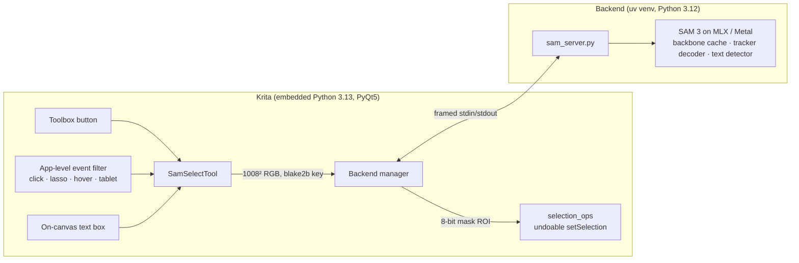

# SAM Select for Krita

**Object selection for Krita powered by Meta's [Segment Anything 3](https://ai.meta.com/sam3/), running locally on Apple Silicon.**

SAM Select adds a tool to Krita's toolbox, next to the built-in selection tools. It has three ways to select:

| | Gesture | What gets selected |
|---|---|---|
| 🖱️ | **Click** an object | That object. With hover preview on, it's highlighted before you click. |
| ➰ | **Draw a freehand lasso** around objects | Every object inside the lasso, or only its main object (set in Tool Options). |
| ⌨️ | **Type** in the on-canvas box ("*type what to select*") and press Return | Every instance of what you describe, such as *cat*, *red car* or *windows*. |

Results are ordinary Krita selections. They show marching ants, go on the undo stack, and work with every selection feature Krita has.

## Combining selections

Modifiers work the same as in Krita's own selection tools, for clicks, lassos and pressing Return in the text box.

| Modifier (macOS) | Mode |
|---|---|
| ⇧ Shift | Add |
| ⌥ Option | Subtract |
| ⇧⌥ | Intersect |
| ⌘ Command | Replace |
| ⌘⌥ | Symmetric difference |

The default mode (the Mode buttons in Tool Options) is **shared with Krita's other selection tools**, and so are Krita's *Selection Mode: Add/Subtract/…* shortcuts. If you turn on *Switch Control/Alt Selection Modifiers* in Krita's preferences, ⌘ and ⌥ swap roles here too.

Canvas navigation still works while the tool is active: Space+drag, pinch, scroll, and the middle and right mouse buttons.

## Requirements

- A Mac with Apple Silicon (M1 or newer), running macOS 14 or later
- Krita **5.3** (tested with 5.3.3)
- About 2.1 GB of free disk space: roughly 350 MB of runtime plus the 1.7 GB model

## Install

1. Download `samselect-vX.Y.Z.zip` (built into `dist/`, see [Building](#building-a-release-zip)).
2. In Krita, choose **Tools › Scripts › Import Python Plugin from File…** and pick the zip.
3. Restart Krita, then check that **Settings › Configure Krita › Python Plugin Manager › SAM Select** is enabled.
4. Pick **SAM Select** in the toolbox (or press **W**). In **Tool Options**, click **Install SAM 3…**.
   This creates a private Python environment in `~/Library/Application Support/SamSelect`. The model downloads on first use.
   After that, everything runs offline.

## Performance

These numbers were measured on an M5 Pro with the bf16 weights, using an 1800×1200 photo in Krita 5.3.3.

| Step | Time |
|---|---|
| Backend start (model already downloaded) | ~2 to 3.5 s, once per session |
| Encode a new image (once per image state, cached) | ~0.4 to 0.8 s |
| Click → selection visible in Krita | ~0.15 s, of which inference is ~10 ms |
| Hover preview | ~10 ms of inference per position |
| Text prompt → selection in Krita | ~0.4 s |
| Lasso → selection (all objects inside, or main object) | ~0.15 to 0.5 s |
| Mask upscaled to an 8000×6000 canvas | ~40 ms |

The tool starts encoding the image as soon as you activate it, so the first click is usually instant.

## How it works



- **Separate process.** MLX and the model run in their own Python, managed with [uv](https://docs.astral.sh/uv/). Krita's UI never blocks, and a backend crash can't take Krita down. The process exits with Krita, and after 20 idle minutes, to free memory.
- **MLX on the GPU.** It uses [mlx-vlm](https://github.com/Blaizzy/mlx-vlm)'s SAM 3 port with the [`mlx-community/sam3-bf16`](https://huggingface.co/mlx-community/sam3-bf16) weights. The click and lasso path is re-implemented in [`engine.py`](src/samselect/server/engine.py) to match the reference SAM 2/3 tracker decoder. That means pixel-centred prompt normalisation, padding tokens, the no-memory embedding, the high-resolution skip order, and a sigmoid on the IoU head. It also keeps the ViT in bf16 (upstream silently promotes it to fp32).
- **One encode per image.** The ViT backbone runs once per image state. Clicks, lassos and hover only run the lightweight decoder. Text prompts reuse the same backbone features.
- **Lasso = objects inside it.** The lasso isn't used as a mask. A grid of point prompts inside it (plus a box prompt on its bounds) finds candidate objects. Only good-quality candidates that sit mostly inside the lasso are kept, so a loose lasso around a person selects the person, not the background you circled.
- **Small transfers.** Krita shrinks the canvas to the model's 1008² input in C++ before sending it. The backend upsamples mask logits straight to canvas resolution on the GPU, anti-aliases edges with a signed-distance estimate, and sends back only the mask's bounding box.

## Development

```bash
python3 scripts/dev_install.py        # symlink src/ into Krita and enable the plugin (quit Krita first)
python3 tests/test_logic.py           # pure-Python tests (modifier mapping, wire protocol)
tests/offscreen/run.sh                # drives the plugin in a fake Krita window with the real backend
~/Library/Application\ Support/SamSelect/venv/bin/python tests/test_server.py   # backend end-to-end
```

Setting `SAMSELECT_SELFTEST=/path/to/script.py` when launching Krita runs that script inside Krita once the window is ready. [`tests/krita_selftest.py`](tests/krita_selftest.py) is a full in-Krita integration test. It opens an image, then clicks, undoes and redoes, types a text prompt, uses the modifiers, draws a lasso and hovers. It saves screenshots and a report, then quits:

```bash
SAMSELECT_SELFTEST=$PWD/tests/krita_selftest.py SAMSELECT_SELFTEST_IMAGE=/path/to/photo.jpg \
SAMSELECT_SELFTEST_OUT=/tmp/samselect-selftest /Applications/krita.app/Contents/MacOS/krita --nosplash
```

Logs are written to `~/Library/Logs/SamSelect/server.log`.

### Building a release zip

```bash
python3 scripts/build_zip.py                     # -> dist/samselect-v<version>.zip
python3 scripts/build_zip.py --copy-to ~/Desktop
```

Each version is written once. To make a new one, bump `src/samselect/version.py` first, so `dist/` keeps every build. The zip has the layout Krita's importer expects: `samselect.desktop`, `samselect.action` and `samselect/`, including explicit folder entries (the importer finds the plugin by its `samselect/` entry). Every build is installed into a scratch folder with Krita's own importer before it's kept, so a zip Krita would reject never reaches `dist/`.

If you use the dev install, run `python3 scripts/dev_install.py --uninstall` before importing a zip: Krita's importer can't replace the symlinked plugin folder.

## Project layout

```
src/
  samselect.desktop, samselect.action   Krita plugin metadata, default shortcut (W)
  samselect/
    controller.py    tool lifecycle, canvas input, prompt → selection flow
    toolbox.py       button inside Krita's toolbox Select section
    options.py       Tool Options panel (mirrors Krita's selection options)
    overlay.py       hover preview, lasso path, spinner, "type what to select" box
    selection_ops.py undoable selection combine (add/subtract/…)
    imaging.py       canvas → 1008² model input
    backend.py       installer, server process, request queue
    server/          runs in the backend venv: engine.py, sam_server.py, protocol.py
scripts/            build_zip.py, dev_install.py
tests/              logic, server and offscreen plugin tests
```

## Limitations

- Krita 6 (Qt6/PyQt6) isn't supported yet. Only PyQt5 is.
- Masks are predicted at 288×288 and then upsampled, so hair and other very fine detail can be softened on large canvases.
- Selections are pixel selections. Krita's vector selection mode isn't offered.
- Detached-canvas windows (*View › Detach Canvas*) aren't handled yet.

## The model: downloaded, not bundled

The release zip is ~45 KB. It doesn't include the SAM 3 weights: on first use, the plugin downloads them from Hugging Face ([`mlx-community/sam3-bf16`](https://huggingface.co/mlx-community/sam3-bf16)), pinned to an exact revision and verified by the Hugging Face client. Tool Options shows the download progress and a link to the SAM License before installing. The SAM License allows redistribution with a copy of the license, so an offline bundle is possible, but a 1.7 GB zip would strain Krita's plugin importer, and the runtime still has to be installed anyway.

## Credits and licenses

- Plugin code: MIT (see [LICENSE](LICENSE)).
- SAM 3 by Meta AI, released under the [SAM License](https://github.com/facebookresearch/sam3/blob/main/LICENSE). The weights are downloaded from Hugging Face on first run and are not redistributed here.
- MLX port: [mlx-vlm](https://github.com/Blaizzy/mlx-vlm) (MIT) and [mlx-community](https://huggingface.co/mlx-community).
